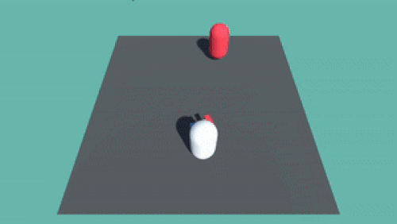

# 🎮 Unity Third-Person Shooter System




A **modular, production-ready** shooter framework with:
- ✅ Player movement & mouse-aiming
- 🔫 Weapon switching/ballistics
- 🤖 NavMesh-powered enemy AI
- 🎮 Input System integration


## ✨ Features
- 🕹️ **Player Controller**  
  - Keyboard movement (WASD)  
  - Mouse-look aiming (cursor position tracking)  
  - Adjustable movement speed  

- 🔫 **Weapon System**  
  - Multiple gun support  
  - Customizable bullet velocity  
  - Fire rate control  
  - Dynamic weapon switching  

- 💥 **Bullet Physics**  
  - Configurable speed  
  - Auto-destruction timer  
  - Smooth movement physics  

- 🤖 **Enemy AI**  
  - NavMesh pathfinding  
  - Target chasing behavior  
  - Optimized path updates  

- 🎛️ **Input Handling**  
  - Unity's new Input System  
  - Clean event-based architecture  


## Prerequisites
- Unity 2021.3+ (LTS)
- [Input System Package](https://docs.unity3d.com/Packages/com.unity.inputsystem@1.7/manual/Installation.html)
- AI Navigation (Window > AI > Navigation)

### Installation
```bash
git clone https://github.com/yourusername/unity-shooter.git
```

### 📜 License
 - MIT License - Free for commercial use. Attribution appreciated!
